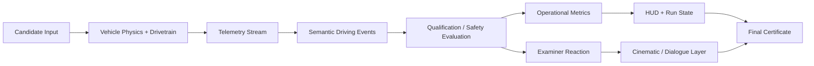

# അടുത്ത സ്റ്റോപ്പിൽ™

**കേരള റൂട്ട്-സർവീസ് ഡ്രൈവർ യോഗ്യതാ സംവിധാനം — a simulation-based public transport qualification system for route-specific operational behaviour.**

> **“ലൈസൻസ് കിട്ടിയത് മാത്രം പോരാ. സർവീസ് പിടിക്കണം.”**

### Live Qualification Build
**[Open അടുത്ത സ്റ്റോപ്പിൽ™](https://adutha-stoppil-144-24-114-90.sslip.io/)**

## Basic Details

### Team Name: അടുത്ത സ്റ്റോപ്പിൽ

### Team Members
- **Team Lead:** Sourav P Bijoy — S7, Sahrdaya College of Engineering & Technology
- **Member 2:** Aradhana Rose — S3, Sahrdaya College of Engineering & Technology

### Project Description

അടുത്ത സ്റ്റോപ്പിൽ™ is a browser-based 3D driving simulation that implements a fictional Kerala public-transport driver qualification process.

The candidate operates a full-size bus through a Kerala-inspired route while an onboard examiner evaluates **സ്റ്റോപ്പ് സെൻസ്**, **സമയം പിടിക്കൽ**, **റോഡ് വായന**, **വണ്ടി കൈയിൽ**, horn communication, surface adaptation and passenger-service behaviour. The system converts these observations into operational metrics and produces a final qualification certificate at the end of the route.

The premise is deliberately unnecessary but internally rigorous: a normal driving licence is treated as only the first layer of eligibility. Route service requires a second, operator-specific assessment of whether the candidate can actually **സർവീസ് പിടിക്കുക** — keep the vehicle, timetable and surrounding traffic under workable control.

Kerala is not treated as a decorative backdrop. The service language deliberately draws from familiar **ആനവണ്ടി**, **കണ്ടക്ടർ ബെൽ**, **ഓട്ടോ ഗ്യാപ്**, **സ്റ്റോപ്പ്**, **കുഴി**, rain and timetable vocabulary, while the implementation remains a fictional simulation rather than a reproduction of any real KSRTC route or operating rule.

### The Problem (that doesn't exist)

Conventional driver licensing primarily evaluates legal compliance, basic vehicle control, signalling, parking and general road safety. It does not provide an operator-specific framework for measuring the informal behaviours associated with high-frequency public transport operation.

This creates a hypothetical assessment gap. A driver may be legally qualified while still lacking measurable evidence in areas such as:

- practical stop-position judgement — **സ്റ്റോപ്പ് സെൻസ്**;
- recovering lost timetable margin — **സമയം പിടിക്കൽ**;
- reading gaps, autos, buses and mixed traffic — **റോഡ് വായന**;
- keeping the vehicle settled during committed manoeuvres — **വണ്ടി കൈയിൽ**;
- context-sensitive acoustic communication — **ഹോൺ ഭാഷ**;
- adapting the same driving decision to rain — **മഴക്കാല ബുദ്ധി**;
- maintaining progress over damaged surfaces — **കുഴി മാനേജ്മെന്റ്**;
- responding to late passenger/conductor stop requests — **ബെൽ റെസ്പോൺസ്**.

The project therefore assumes that an additional certification process is required before a driver can be considered operationally qualified for a fictional Kerala public transport service.

### The Solution (that nobody asked for)

The system introduces a dedicated **KSRTC Driver Qualification Test** implemented as an interactive 3D simulation.

A candidate drives a monitored assessment route with an examiner, conductor and passengers onboard. Vehicle telemetry is continuously evaluated against a fictional qualification model. Instead of producing only a pass/fail result, the system derives multiple behavioural indicators and records how the candidate handles each operational situation.

The current qualification model includes:

| Metric | Kerala operating term | Operational interpretation |
| --- | --- | --- |
| **Passenger Fitness** | **നടത്തം ബോണസ്** | Estimates the additional walking distance created by imperfect stop placement. |
| **Schedule Recovery** | **സമയം പിടിക്കൽ** | Measures the candidate's ability to regain fictional timetable performance through sustained route progress. |
| **Road Ownership** | **റോഡ് വായന** | Represents decisiveness in positioning and mixed-traffic negotiation. |
| **Horn Diplomacy** | **ഹോൺ ഭാഷ** | Evaluates context-sensitive acoustic communication with surrounding road users. |
| **Managed Recklessness** | **വണ്ടി കൈയിൽ** | Records aggressive-looking manoeuvres that remain inside the simulation's control envelope. |
| **Examiner Approval** | **സാറിന്റെ മാർക്ക്** | Tracks cumulative institutional confidence in the candidate. |
| **Textbook Contamination** | **ഡ്രൈവിംഗ്-സ്കൂൾ ലക്ഷണം** | Detects excessive dependence on conventional driving-school behaviour. |

The assessment deliberately produces counter-intuitive outcomes. For example, exact stop placement may increase Textbook Contamination, while a controlled offset may increase Passenger Fitness and Examiner Approval. The same aggressive manoeuvre may be rewarded on a dry road and penalised when road conditions no longer support it.

This is a fictional simulation and is not affiliated with KSRTC. It is not intended as driving guidance, and its scoring model should not be interpreted as a description of real KSRTC drivers or real public-transport operating policy.

## കേരള റൂട്ട് പദാവലി

The following terms form part of the qualification record and are used consistently across route assessment, examiner notes and result interpretation.

| Term | Meaning inside the qualification system |
| --- | --- |
| **സ്റ്റോപ്പ് സെൻസ്** | Knowing where the bus should actually come to rest relative to a stop, passengers and road geometry. |
| **സമയം പിടിക്കൽ** | Recovering lost timetable margin without losing control of the vehicle. |
| **റോഡ് വായന** | Reading gaps, autos, parked vehicles, road width and the intentions of surrounding traffic. |
| **വണ്ടി കൈയിൽ** | Keeping a heavy bus composed while driving with commitment. |
| **ഹോൺ ഭാഷ** | Treating a short, contextual horn as part of road communication rather than background noise. |
| **മഴക്കാല ബുദ്ധി** | Understanding that dry-road confidence cannot simply be copied onto a wet road. |
| **കുഴി മാനേജ്മെന്റ്** | Balancing route progress, suspension movement and passenger comfort over broken surfaces. |
| **ബെൽ റെസ്പോൺസ്** | Responding to a late stop request without converting it into a full operational crisis. |

Each term maps directly to a measurable telemetry or encounter outcome in the qualification model.

## Qualification Procedure

The integrated demonstration route is approximately 900 metres long and contains eight authored assessment situations.

| Stage | Kerala service brief | Assessment | Primary observation |
| --- | --- | --- | --- |
| 01 | **സ്റ്റോപ്പ് സെൻസ്** | Stop-position assessment | Door placement relative to the designated stop area |
| 02 | **ഓട്ടോ ഗ്യാപ്** | Auto-rickshaw negotiation | Commitment and clearance through a constrained lane |
| 03 | **റോഡ് വായന** | Lateral-positioning assessment | Use of available road space through a chicane |
| 04 | **ഹമ്പ് മാനേജ്മെന്റ്** | Suspension confidence assessment | Vehicle behaviour across a speed breaker |
| 05 | **കുഴി മാനേജ്മെന്റ്** | Rough-surface assessment | Progress and stability over damaged road surface |
| 06 | **ക്യൂ മാനേജ്മെന്റ്** | Queue-progress assessment | Maintaining useful forward movement in constrained traffic |
| 07 | **ബെൽ റെസ്പോൺസ്** | Late-stop recovery | Response to a delayed passenger stop requirement |
| 08 | **സമയം പിടിക്കൽ** | Final timetable assessment | Sustained service pace before entering the terminal |

A meaningful collision with an assessment obstacle generates a direct disqualification condition. Near-miss or high-commitment behaviour can still contribute to qualification metrics when the bus remains under control.

## Technical Details

### Technologies/Components Used

For Software:
- **Language:** TypeScript
- **UI:** React
- **3D Rendering:** Three.js + React Three Fiber
- **Physics:** Rapier 3D
- **State / Runtime Systems:** React state, Zustand-based modules and framework-neutral gameplay cores
- **Build Tool:** Vite
- **Audio:** Web Audio API + layered runtime audio assets
- **Asset Pipeline:** Blender
- **Testing:** deterministic gameplay-system tests, physics benchmarks, build/lint validation

For Hardware:
- Desktop or laptop with a modern WebGL-capable browser
- Keyboard for desktop controls
- Touchscreen device supported by the mobile control layer
- No external hardware is required

### Vehicle Model

The vehicle simulation uses a dynamic raycast-wheel architecture rather than a kinematic controller.

- Effective mass: **13,200 kg**
- Wheelbase: **5.64 m**
- Track width: **2.04 m**
- Wheel radius: **0.48 m**
- Physics timestep: **1/60 s**
- Six forward drivetrain bands
- Speed-sensitive steering
- Surface-specific grip for asphalt, wet road, laterite and rough road
- Suspension, body-roll and brake-dive response
- Keyboard and touch input paths

### System Architecture



The simulation separates physical safety from qualification scoring. Collision and loss-of-control events are evaluated independently from the fictional examiner's preferences, allowing the project to reward unusual behaviour without treating physical failure as a successful outcome.

### Runtime Flow

**അപേക്ഷ → റൂട്ട് പരീക്ഷ → എക്സാമിനർ വിലയിരുത്തൽ → ഡിപ്പോ → സർട്ടിഫിക്കറ്റ്**

```text
application desk
    ↓
candidate registration
    ↓
qualification route begins
    ↓
vehicle telemetry + authored encounters
    ↓
examiner / conductor / passenger reactions
    ↓
qualification metrics updated
    ↓
terminal arrival
    ↓
certificate generation
```

## Implementation

### Installation

```bash
git clone https://github.com/Phloraxx/useless_project_temp.git
cd useless_project_temp/reboot/game-v3
npm ci
```

### Run

```bash
npm run dev
```

### Production Validation

```bash
npm run lint
npm run build
```

### Controls

| Input | Function |
| --- | --- |
| `W` / Up | Throttle |
| `S` / Down | Service brake / reverse near standstill |
| `A` / `D` | Steering |
| `Space` | Full brake |
| `H` | Horn |
| `R` | Reset vehicle / assessment run |

Mobile touch steering follows the same left/right convention as the desktop control path.

## Project Documentation

### Screenshots


*Kerala-inspired authored roadside environment used to validate the world-design and streaming system.*


*Examiner-focused grading presentation from the cinematic direction system.*


*Seated examiner animation proof using the character state and motion-reaction system.*

### Integrated Demonstration

The default application in `reboot/game-v3` is the current integrated vertical slice:

```text
application screen
→ approximately 900 m qualification route
→ eight scored driving assessments
→ examiner reactions and onboard characters
→ terminal arrival
→ generated qualification certificate
```

The route contains a Kerala-inspired roadside presentation, physical traffic obstacles, an onboard examiner, conductor and passenger, vehicle-motion reactions, layered driving audio, cinematic grading moments and collision-driven disqualification.

The recommended presentation sequence is documented in [`reboot/JUDGE_DEMO.md`](reboot/JUDGE_DEMO.md).

### Major Subsystems

- **Vehicle Physics and Drivetrain** — heavy-bus dynamics, surface response, braking, steering and fixed-step simulation.
- **World System** — authored Kerala road environments, route chunks and roadside props.
- **Qualification Engine** — semantic driving events, examiner scoring, Flow and run-state logic.
- **Characters** — examiner, conductor and passenger animation states with vehicle-motion overlays.
- **Cinematics** — reusable camera states and examiner-focused judgement shots.
- **Audio** — engine layers, drivetrain transitions, brakes, horn, road surface, rain and ambience.
- **Dialogue** — structured Malayalam dialogue data designed for short situational responses.

Detailed subsystem contracts are available in [`reboot/INTEGRATION_CONTRACT.md`](reboot/INTEGRATION_CONTRACT.md) and [`reboot/INTEGRATION_ORDER.md`](reboot/INTEGRATION_ORDER.md).

## Verification

The integrated project is maintained with repeatable technical checks:

- production TypeScript/Vite build;
- static lint validation;
- deterministic gameplay-system regression tests;
- vehicle benchmark suite;
- touch-steering direction verification;
- source and asset provenance tracking.

At the current integration checkpoint, the gameplay-system regression suite passes all seven deterministic checks, including collision non-reward, encounter anti-repetition and separation of fictional qualification outcomes from safety outcomes.

## Asset and Licensing Policy

Public project assets are restricted to authored material and assets with documented redistribution rights. CC0 sources are recorded in [`reboot/SOURCE_LEDGER.md`](reboot/SOURCE_LEDGER.md) and the relevant subsystem provenance files.

A third-party bus OBJ evaluated during development did not include sufficient redistribution information. The original mesh, its texture and derived public-facing exports are therefore excluded from this repository. The public project uses independently authored/prototype bus assets instead.

## Project Demo

The project can currently be demonstrated locally using `reboot/game-v3`.

The intended judge demonstration is a single continuous qualification run ending in the generated certificate. No engineering/debug interface is required during the normal demonstration; the handling and telemetry tools remain available separately for development and validation.

## Team Contributions

- **Sourav P Bijoy:** Team lead; system architecture, simulation implementation, integration, testing, production pipeline and technical direction.
- **Aradhana Rose:** Concept development, qualification-model ideation, interaction design, scenario design and project framing.

---

Built for **TinkerHub Useless Projects 3.0**.


