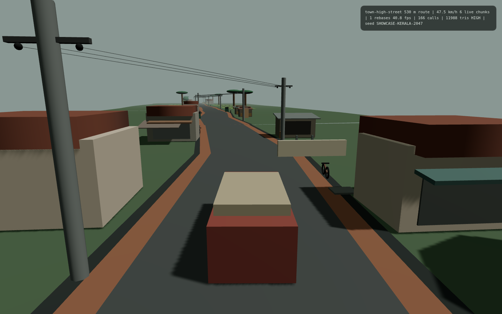
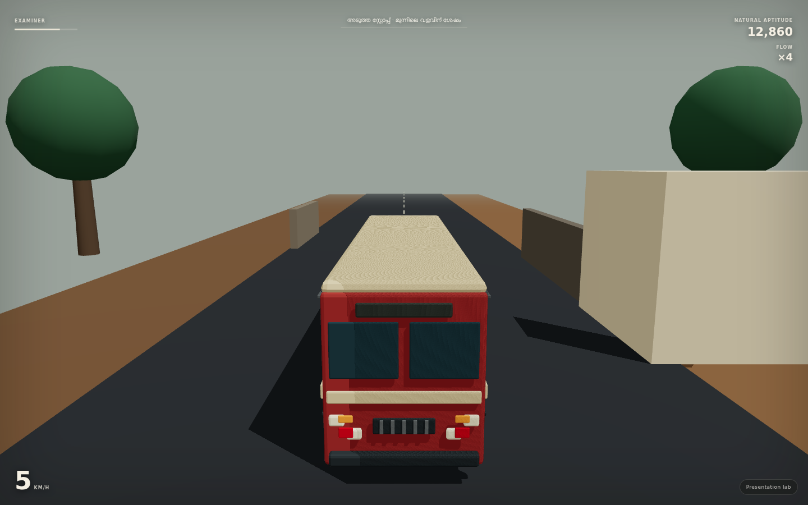
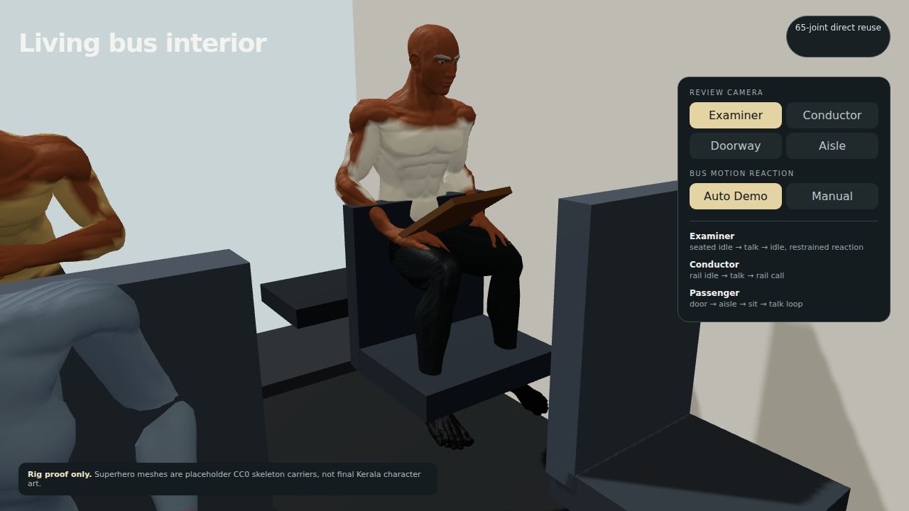

# അടുത്ത സ്റ്റോപ്പിൽ™ 🎯

## Basic Details
### Team Name: അടുത്ത സ്റ്റോപ്പിൽ

### Team Members
- Team Lead: Sourav P Bijoy — S7, Sahrdaya College of Engineering & Technology
- Member 2: Aradhana Rose — S3, Sahrdaya College of Engineering & Technology

### Project Description
A fake **KSRTC Driver Qualification Test** built for TinkerHub Useless Projects. Normal driving tests reward careful textbook driving; this one sarcastically asks whether you have enough fictional “KSRTC instinct” to pass. On a dry road, confident and reckless-looking-but-controlled driving can earn absurd qualification points. Actually crashing, hitting pedestrians or losing the bus still fails you.

### The Problem (that doesn't exist)
Normal licences have an obvious flaw: they only test whether you can drive properly. Nobody checks whether you can stop three metres away from the bus stop for passenger cardio, convert a horn into a communication protocol, recover an impossible timetable, or demonstrate sufficient fictional ownership of the road.

### The Solution (that nobody asked for)
Build an unnecessarily serious “public-service optimisation platform” around an imaginary KSRTC qualification licence. The system measures **Passenger Fitness**, **Schedule Recovery**, **Road Ownership**, **Horn Diplomacy**, **Managed Recklessness**, **Examiner Approval**, and the dangerous condition known as **Textbook Contamination**. The joke is that the website presents every useless/inverted behaviour as a socially beneficial innovation.


### Core Useless Metrics
- **Passenger Fitness:** stop a few metres before/after the marker and the system credits the passengers with free walking distance.
- **Schedule Recovery:** maintain an assertive pace on a dry road and “recover” fictional timetable debt.
- **Road Ownership:** decisive lane positioning, committed cornering and contextual horn use build institutional confidence.
- **Horn Diplomacy:** press `H`; one well-timed horn is treated as a complete communications protocol.
- **Managed Recklessness:** reckless-looking but controlled dry-road driving earns parody points; the same behaviour on wet roads is marked as unjustified enthusiasm.
- **Textbook Contamination:** suspiciously perfect driving increases this failure metric.

The game is parody, not a claim about every real KSRTC driver and not real driving advice. The stereotypes are deliberately exaggerated from common Kerala internet jokes/complaints.

## Technical Details
### Technologies/Components Used
For Software:
- TypeScript / React
- Three.js + React Three Fiber
- Rapier 3D physics
- Vite
- Zustand
- Web Audio API
- Blender asset pipeline
- Authored chunk streaming, encounter/scoring and cinematic systems

### Implementation
The repository contains the integrated V3 work-in-progress plus the isolated workstreams used to build and validate each major subsystem.

#### Installation
```bash
cd reboot/game-v3
npm ci
```

#### Run
```bash
npm run dev
```

#### Production build
```bash
npm run build
```

Desktop controls: `W` throttle, `S` brake/reverse, `A/D` steering, `Space` emergency brake, `H` horn diplomacy, `R` reset. Mobile touch steering uses the same physical left/right convention as keyboard input.

## Project Documentation

### Screenshots

*Authored Kerala-style town chunk from the endless-world streaming workstream.*


*Examiner grading presentation from the reusable cinematic director proof.*


*Seated examiner animation/state-graph proof inside the bus.*

### Architecture
The reboot was deliberately split into independently testable workstreams and then brought together through a shared integration contract:

`input → drivetrain/physics → world streaming → semantic driving events → encounter director → examiner scoring → cinematics/dialogue/audio → presentation`

See [`reboot/INTEGRATION_CONTRACT.md`](reboot/INTEGRATION_CONTRACT.md) and [`reboot/INTEGRATION_ORDER.md`](reboot/INTEGRATION_ORDER.md) for the exact contracts and integration sequence.

### Major Workstreams
- Physics + drivetrain — 13.2 t effective bus, 5.64 m wheelbase, 6-speed arcade drivetrain, fixed-step tests and corrected touch steering.
- Endless world — seeded streaming of authored Kerala road chunks with world-origin rebasing and logical route distance.
- Gameplay systems — encounters, player run state, Flow, examiner scoring and the live Useless Qualification Board.
- Characters — seated examiner/conductor/passenger animation states and vehicle-motion overlays.
- Cinematics/UI — camera-state director, safe/unsafe grading reactions and presentation UI.
- Audio — layered telemetry-driven engine, shifts, brakes, horn, rain, road and Kerala ambience.
- Dialogue/story — spoken-Malayalam draft dialogue, progression, callbacks and deadpan institutional comedy.

### Asset / License Note
CC0 assets and audio used by the public project are documented in [`reboot/SOURCE_LEDGER.md`](reboot/SOURCE_LEDGER.md) and workstream provenance files.

A newer bus mesh experimented with during development was derived from a user-downloaded OBJ whose redistribution rights could not be established. That source, its texture and derived "authentic" bus exports are intentionally **not included in this public repository**. The source code and authored blockout/prototype assets remain available without publishing that unresolved third-party material.

### Project Demo
The current repository is an active integration snapshot. Run `reboot/game-v3` locally using the commands above. The subsystem proofs and handoff documents are kept in `reboot/workstreams/` so the development trail is reproducible.

## Team Contributions
- Sourav P Bijoy: Team lead; game direction, implementation/integration, testing and production pipeline.
- Aradhana Rose: Concept development, satire/gameplay ideation and useless-project framing.

---
Made at TinkerHub Useless Projects


